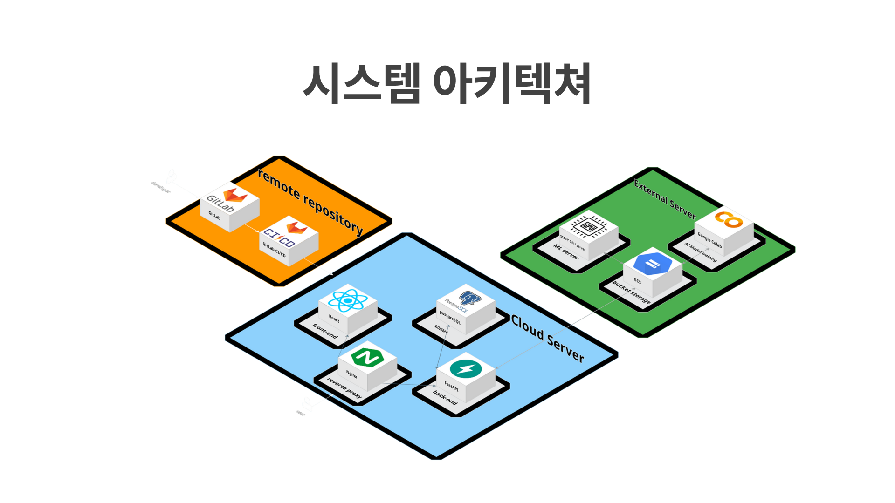

# 돋음 (Dotum)

 

> AI 전문 기업 **BrainDeck**과 함께한 언어 재활 실시간 피드백 서비스

## 📖 Project Overview  
**돋음(Dotum)**은 AI 전문 기업 BrainDeck과 연계하여 개발된, UTAP(우리말 조음음운평가) 기반의 언어 재활 평가 및 피드백 플랫폼입니다.  
딥러닝 음성 분석 기술을 활용해 환자의 발화를 정밀 진단하고, 환자가 **자신의 얼굴로 정확하게 발음하는 합성 영상(Video Self-Modeling)**을 시각적 피드백으로 제공합니다. 이를 통해 단순 반복 훈련을 넘어, 환자가 자신의 이상적인 발화 모습을 보며 스스로 상태를 인지하고 교정할 수 있는 체계적인 재활 환경을 구축하고자 합니다.

 

## ✨ Key Features & Architecture

- **Advanced Voice Analysis:**   
음성 분석 전문 도구인 `Praat`을 Python 백엔드에서 제어하여, CPP(Cepstral Peak Prominence), CSID(Cepstral Spectral Index of Dysphonia) 등 언어 재활의 핵심 음향 지표를 자동으로 추출하고 정량화합니다.

- **Scalable Media Pipeline:**   
`Google Cloud Storage(GCS)`를 기반으로 사용자의 음성 녹음 파일, TTS 샘플 등 대용량 미디어 데이터를 안정적으로 관리하는 파이프라인을 구축했습니다. `ElevenLabs` API와 연동하여 고품질 음성을 합성(TTS)하고 GCS에 저장하는 프로세스를 자동화하여 확장성을 확보했습니다.

- **Secure Authentication System:**   
`JWT`의 Access/Refresh Token 모델을 채택하고, Refresh Token은 `HttpOnly` 쿠키에 저장하여 XSS 공격을 방지합니다. 또한, Refresh Token 재발급 시 기존 토큰을 무효화하는 **회전(Rotation, RTR) 전략**을 적용하여 토큰 탈취 시에도 피해를 최소화하는 보안 아키텍처를 구현했습니다.

- **Domain-Driven Modular Design:**  
`FastAPI`의 `APIRouter`를 활용하여 인증, 사용자, 재활 기록 등 도메인별로 API를 모듈화하여 코드의 유지보수성과 재사용성을 극대화했습니다.  
모든 삭제 로직에는 `Soft Delete` 패턴을 적용하여 데이터의 무결성과 복구 가능성을 보장합니다.

- **Containerized Environment:**   
`Docker Compose`를 활용하여 FastAPI 애플리케이션, MySQL 데이터베이스, Redis 캐시 서버를 단일 명령어로 실행하고 유기적으로 연동할 수 있는 환경을 구축했습니다. 이를 통해 개발 환경을 표준화하고 배포 과정의 복잡성을 크게 줄였습니다.

 

## 🚀 Getting Started
상세한 설치 방법, 환경 변수 설정, 실행 가이드는 별도 문서에 정리되어 있습니다.
개발 환경 세팅을 위해 아래 문서를 참고해 주세요.

[👉 **📚 Developer Manual (Execution & Deployment)**](./exec/MANUAL.MD)  
[👉 **📚 AI Manual (Execution & Deployment)**](./serving-server/README.md)