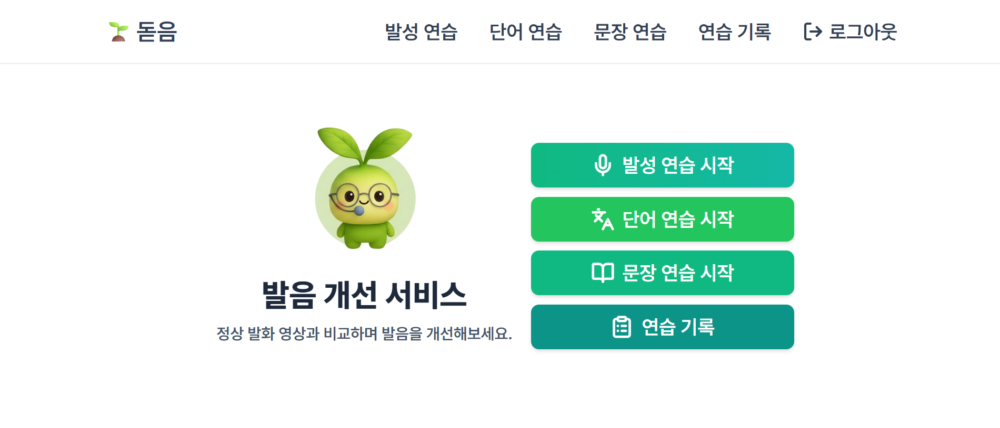
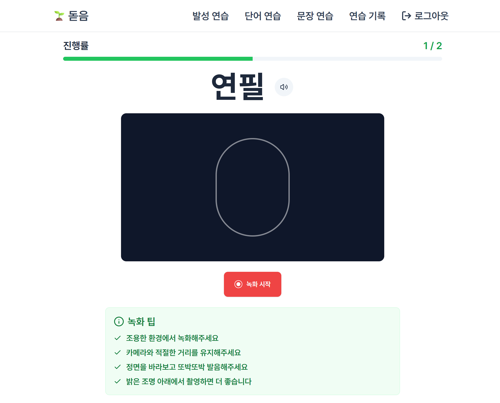
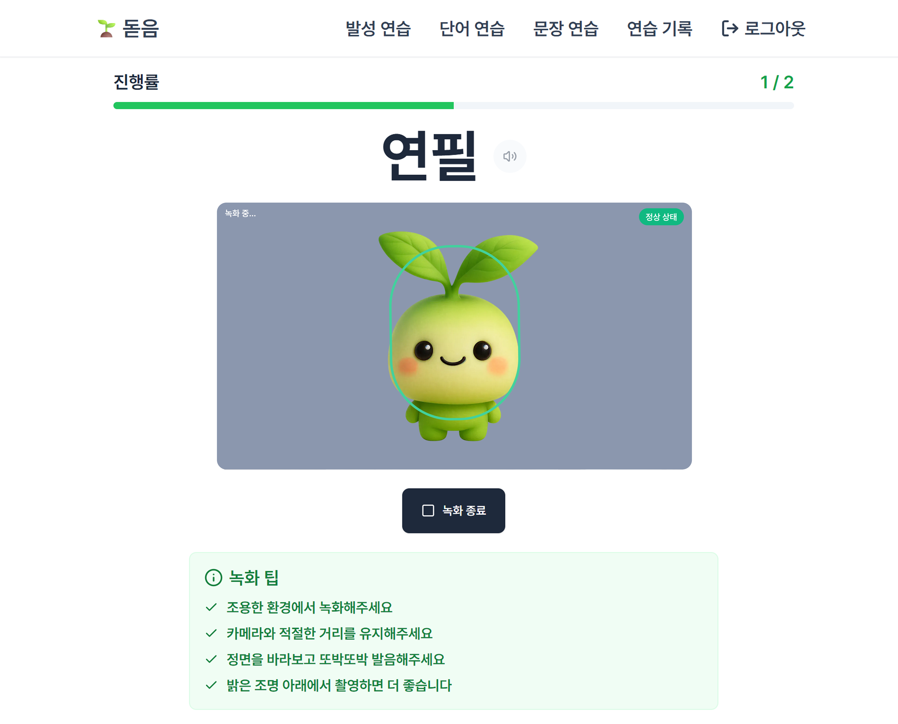
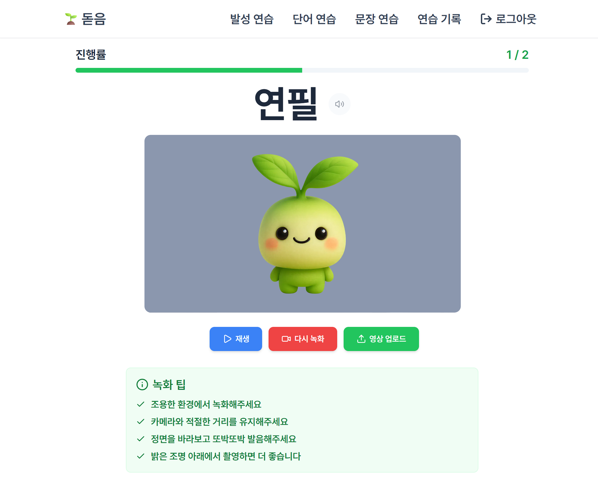
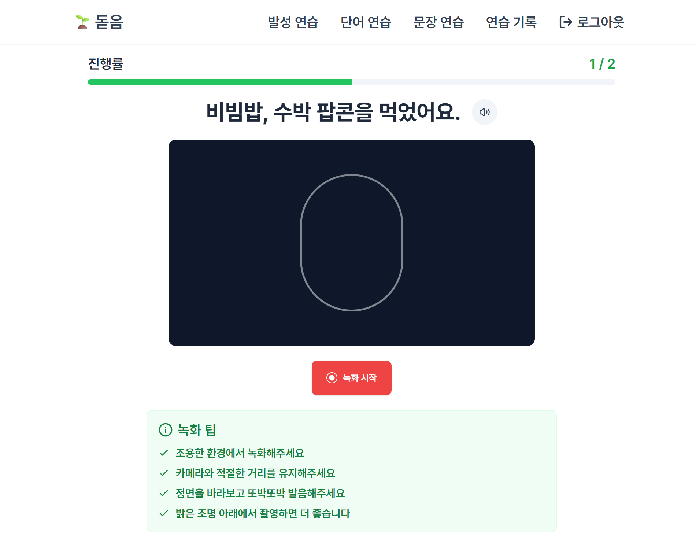
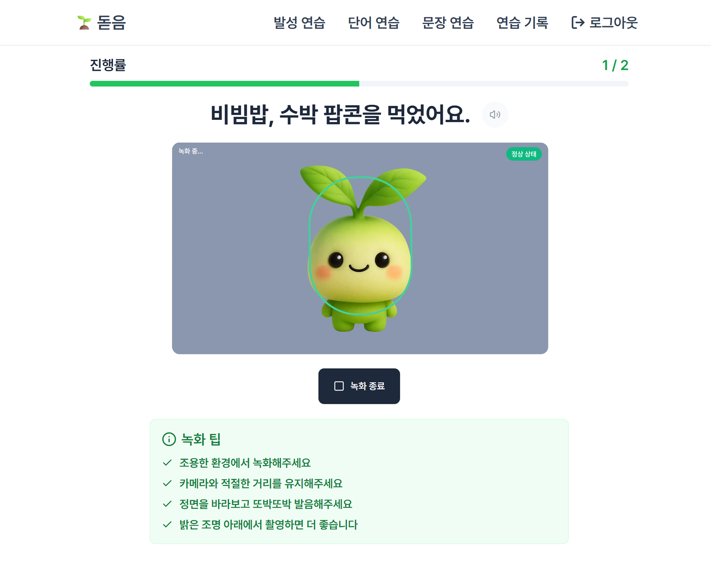
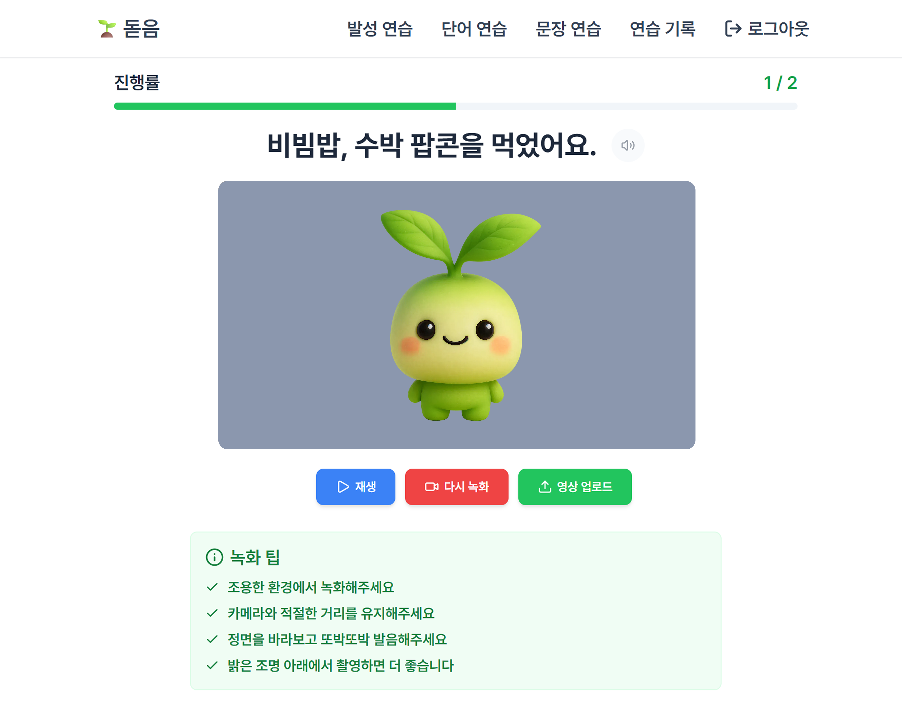
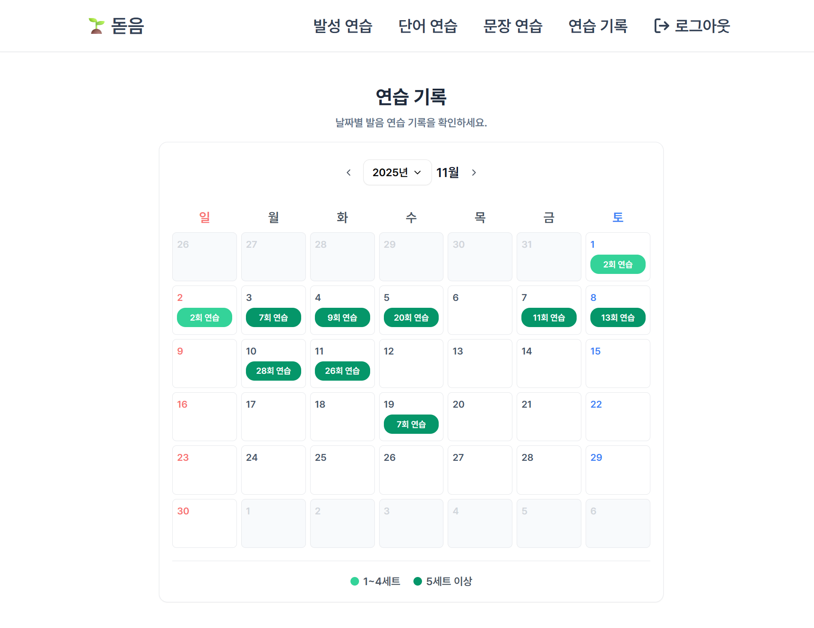
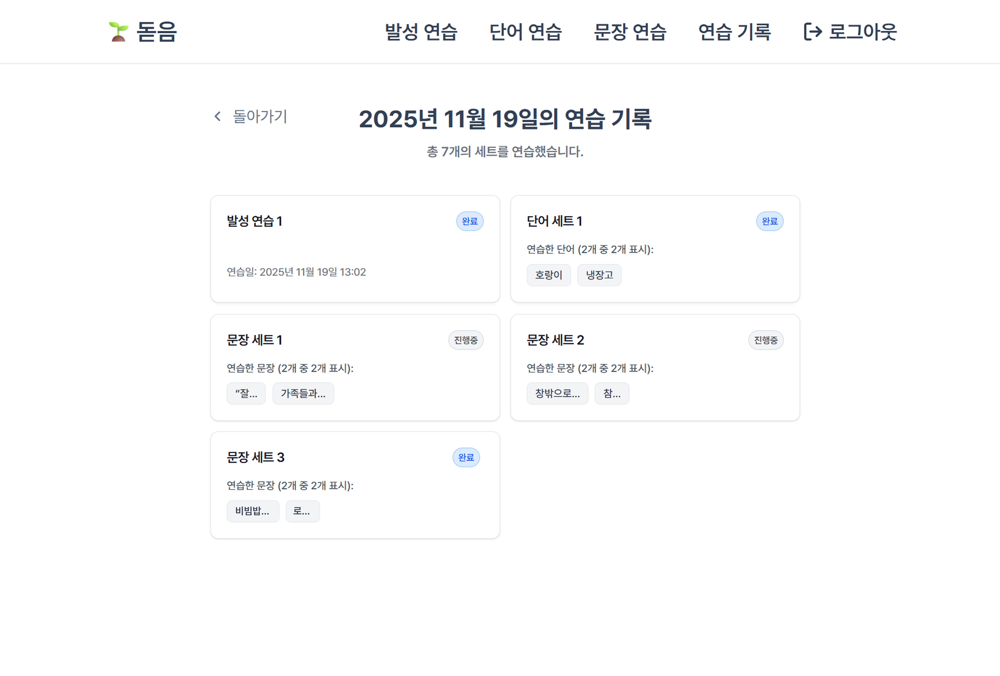
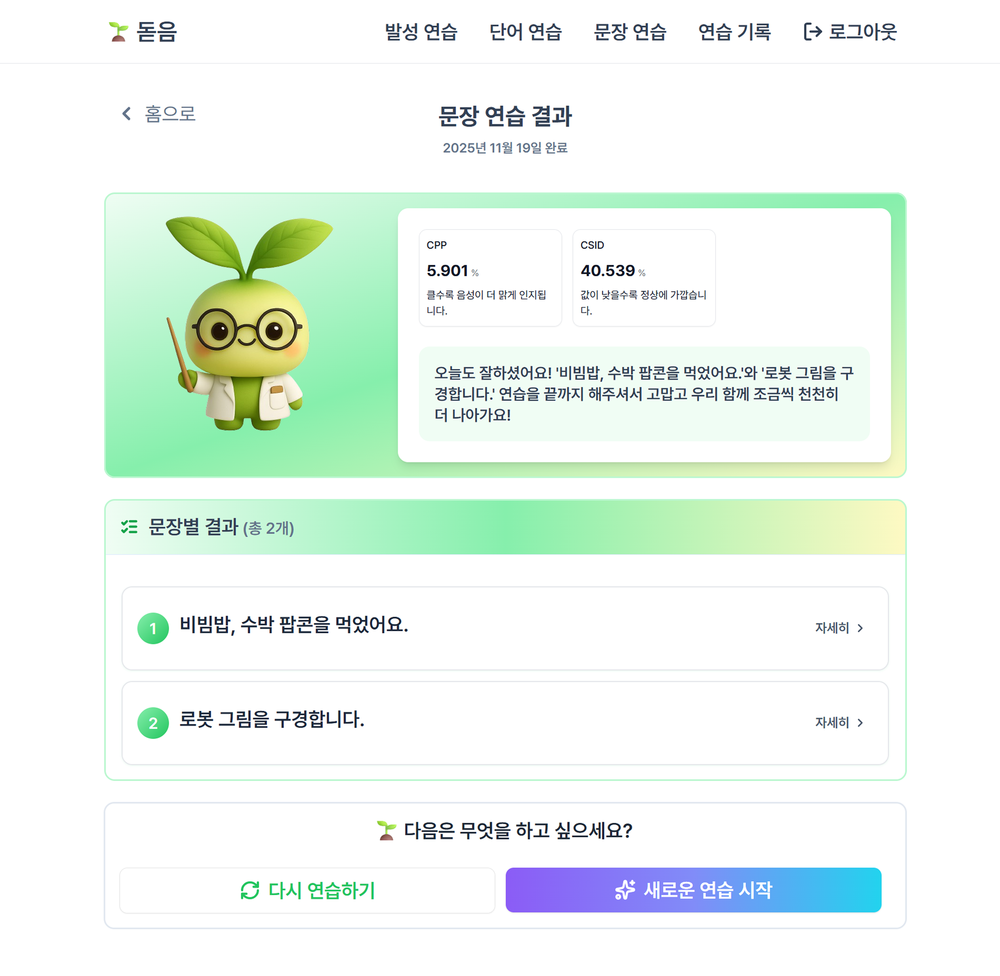

# 시연 시나리오

## 1. 메인 화면

메인 화면에서 '단어 연습 시작' 버튼을 클릭합니다.

---

## 2. 단어 연습 시작

### 2-1. 녹화 전 화면

단어 연습 화면이 생성되면 '녹화 시작' 버튼을 클릭합니다.

### 2-2. 녹화 중 화면

녹화가 시작되었습니다. 단어를 발음하며 녹화를 진행합니다.

### 2-3. 녹화 완료 화면

녹화가 완료되면 '녹화 종료' 버튼을 클릭한 후, '영상 업로드' 버튼을 클릭합니다.

다음 단어가 생성되면 동일한 과정을 반복합니다.

단어 연습이 완료되면 내비게이션바에서 '문장 연습' 버튼을 클릭합니다.

---

## 3. 문장 연습 시작

### 3-1. 녹화 전 화면

문장 연습 화면이 생성되면 '녹화 시작' 버튼을 클릭합니다.

### 3-2. 녹화 중 화면

녹화가 시작되었습니다. 문장을 발음하며 녹화를 진행합니다.

### 3-3. 녹화 완료 화면

녹화가 완료되면 '녹화 종료' 버튼을 클릭한 후, '영상 업로드' 버튼을 클릭합니다.

다음 문장이 생성되면 동일한 과정을 반복합니다.

문장 연습이 완료되면 내비게이션바에서 '연습 기록' 버튼을 클릭합니다.

---

## 4. 연습 기록

연습 기록 화면에서 달력을 확인하고, 'n회 연습'이라고 표시된 날짜를 클릭합니다.

---

## 5. 연습 기록 상세

선택한 날짜의 상세 화면에서 완료된 '문장 세트' 카드 클릭합니다.

---

## 6. 문장별 결과 목록

'문장별 결과' 섹션에서 첫 번째 문장의 '자세히' 버튼을 클릭합니다.

---

## 7. 문장별 결과 자세히

문장별 결과 자세히 화면에서:
1. '현재 내 발음' 버튼을 클릭하여 녹음된 발음을 재생합니다.
2. 이어서 '정확한 발음' 버튼을 클릭하여 올바른 발음을 재생합니다.

발음을 비교하며 연습을 마무리합니다.

